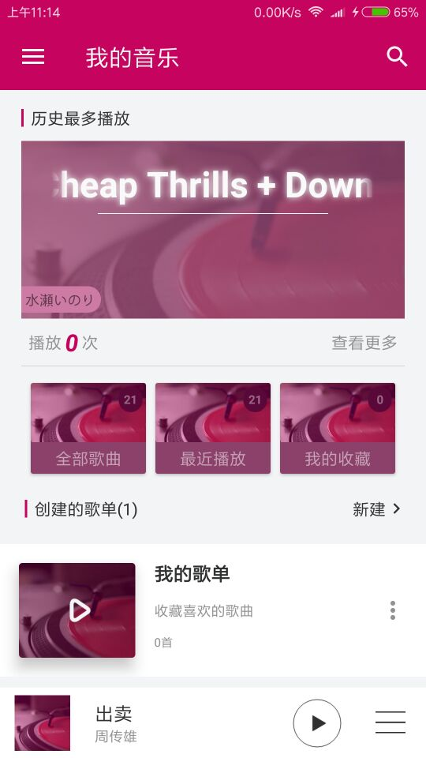
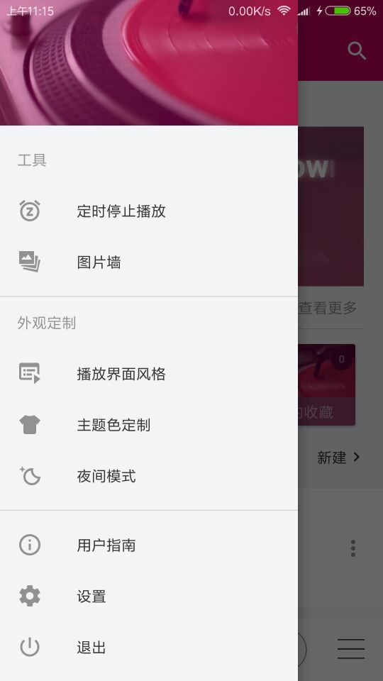
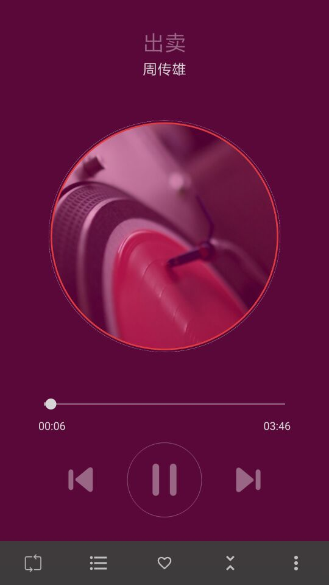

# Music
音乐播放器的集合


## Musicodo
音乐是一款开源Android手机本地音乐文件播放器,致敬Musicoco


### 功能特点
* 通过耳机和通知栏快捷控制音乐播放
* 创建歌单
* 本地歌曲搜索
* 歌曲多选操作
* 记忆播放
* 自动切换到夜间模式
* 定时停止播放
* 应用主题自定义
* 播放界面风格选择。

应用开启了单独的播放服务进程，在服务进程中控制音乐播放逻辑

仿照开源项目:[DuanJiaNing/Musicoco](https://github.com/DuanJiaNing/Musicoco)

### 项目截图
<a href="./art/musicodo_main1.jpg"></a><a href="./art/musicodo_main2.jpg"></a><a href="./art/musicodo_play1.jpg"></a>

App体验地址:[Musicoco - fir.im](https://github.com/DuanJiaNing/Musicoco/raw/master/apk/app-release-v1.1.0.apk)


## ListenerMusicPlayer
一款优雅的遵循"Material Design"的开源音乐播放器，UI参考"腾讯轻听"音乐播放器,
  使用Lastfm Api与酷狗歌词Api。项目架构采用mvp-clean，基于Retrofit2 +
  Dagger2 + RxJava + RxBus + Glide。


### 功能特点
* 我的歌曲：展示本地所有的音乐文件，由歌曲、歌手、专辑三个标签页分类展示，数据取自系统媒体库。为了防止媒体库数据与本地不同步，应用启动时会主动刷新媒体库。
* 正在播放：该模块体现为固定在每个页面下方的播放控制区，展开后可查看全部操作，包括标记喜欢、打开播放列表及查看歌词。歌词API由酷狗提供。
* 文件夹：展示本地所有包含音乐文件个文件夹
* 我的歌单：展示用户创建的歌单
* 我喜欢：展示用户标记为喜欢的歌曲
* 最近播放：展示用户最近播放的歌曲
* 最近添加：展示最近添加的歌曲
* 播放排行：综合歌曲过去每周的播放历史和当前周播放次数得出歌曲排行
* 本地搜索：根据关键词搜索相关的歌曲、专辑和歌手
* 设置：该模块包括切换日夜间模式和更换出题

### 导入问题
  * 这个项目导入时候可能麻烦以下的问题:
    ```
    Error:Could not find com.tencent.mm:AndResGuard-gradle-plugin:1.2.0.
    Searched in the following locations:
        file:/D:/Android/Android Studio/gradle/m2repository/com/tencent/mm/AndResGuard-gradle-plugin/1.2.0/AndResGuard-gradle-plugin-1.2.0.pom
        file:/D:/Android/Android Studio/gradle/m2repository/com/tencent/mm/AndResGuard-gradle-plugin/1.2.0/AndResGuard-gradle-plugin-1.2.0.jar
        https://jcenter.bintray.com/com/tencent/mm/AndResGuard-gradle-plugin/1.2.0/AndResGuard-gradle-plugin-1.2.0.pom
        https://jcenter.bintray.com/com/tencent/mm/AndResGuard-gradle-plugin/1.2.0/AndResGuard-gradle-plugin-1.2.0.jar
    Required by:
        :ListenerMusicPlayer:unspecified
    ```

    解决也很简单啦:[【Android笔记-异常-8】在引入AndResGuard时异常 - CSDN博客](http://blog.csdn.net/xihuandaxiaojie/article/details/78713808)
    ,按照教程所言的把这个插件更新更新到最新版即可,该插件的地址:[传送门](https://github.com/shwenzhang/AndResGuard)
  * 等到学了MVP有时间再来挑战,MVP入门推荐项目:[ReadHub资讯客户端](https://github.com/BryantPang/ReadHub)

仿照开源项目:[hefuyicoder/ListenerMusicPlayer: A Grace Material Design Music Player](https://github.com/hefuyicoder/ListenerMusicPlayer)
         或者[听听，一款优雅的开源音乐播放器 | 乌有先生的个人博客](http://hefuyicoder.com/2017/04/15/%E5%90%AC%E5%90%AC%EF%BC%8C%E4%B8%80%E6%AC%BE%E4%BC%98%E9%9B%85%E7%9A%84%E5%BC%80%E6%BA%90%E9%9F%B3%E4%B9%90%E6%92%AD%E6%94%BE%E5%99%A8/)


## 其他类似优秀项目
* [Android开源在线音乐播放器——波尼音乐 - 简书 ](https://www.jianshu.com/p/1c0f5c4f64fa)
  * 该项目依赖库很少,没有涉及RxJava,retrofit等框架,是一个很好的打基础项目
  * 本来也是我首选模仿的Music项目,但由于模仿过程中发现作者的项目架构不明显(没按
    模块化进行开发)以及涉及的逻辑复杂,只好忍心割痛放弃
* [simplebam/Weather: 天气应用App合集](https://github.com/simplebam/Weather)
  * 很多朋友看完郭神的[第一行代码](http://blog.csdn.net/guolin_blog/article/details/52032038)
    之后就开始信心足足去博客或者公众号找优质的资源,有些人收到的效果很好,但有些人
    像我这样不仅模仿不到位还导致进入迷惑圈导致效果甚微,这里的话看底子,如果你从
    Java后台转Android开发,码ListenerMusicPlayer项目无疑是最好的,但如果你像我
    这样基础不给力的话,我建议还是分散来学习,一个项目掌握一两个就好,虽然笨拙,但总
    比以前好很多,所以不妨试试这个项目集


## 推荐阅读-推荐的不仅仅是技术
* [对不起，我的文案已经比不过00后了！-情书参考](http://mp.weixin.qq.com/s/GMSKJnX3JyrdnguKsMQD_Q)
* [推荐3个优质学习项目](http://mp.weixin.qq.com/s/nTo7rqt0Y839r6O28uQW8Q)
* [开源一款超级好用的mp3剪切器app](http://mp.weixin.qq.com/s/9OK1gJgsctnt6WA04LCYCA)
* [程序员接私活的途径以及正确方式](https://mp.weixin.qq.com/s/9a1QsOj3sJ6N4CaeZfWdvQ)
* [软件开发知识体系 ](https://mp.weixin.qq.com/s/A5n9PG0aUl2z2z3zakZF3A)


## Support
最近在项目中学习,在项目中成长,所以亲们会看到我在项目里面写博客啦,哈哈哈 <br/>
如果你喜欢这个repository，请我喝杯咖啡，我会让它更完美~ <br/>

<a href="get_me_a_drink.png"></a>