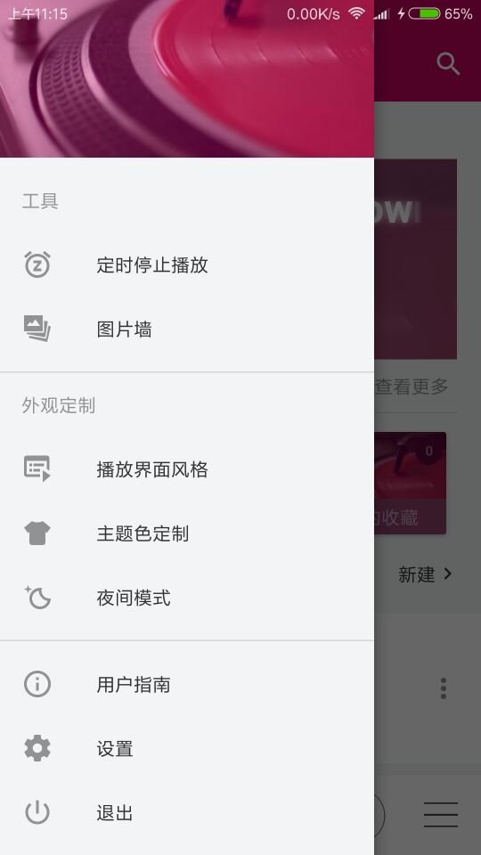

## Musicodo
音乐是一款开源Android手机本地音乐文件播放器,致敬Musicoco

### 功能特点
* 通过耳机和通知栏快捷控制音乐播放
* 创建歌单
* 本地歌曲搜索
* 歌曲多选操作
* 记忆播放
* 自动切换到夜间模式
* 定时停止播放
* 应用主题自定义
* 播放界面风格选择。

应用开启了单独的播放服务进程，在服务进程中控制音乐播放逻辑

仿照开源项目:[DuanJiaNing/Musicoco](https://github.com/DuanJiaNing/Musicoco)

### 项目截图

App体验地址:[SimpleMusic - fir.im ](https://fir.im/simm)

### 项目中用到的知识：[DevelopmentKnowledge](./DevelopmentKnowledge.md)

### 项目中的用到的开源框架
* ButterKnife
  * [ButterKnife8.5.1 使用方法教程总结 - CSDN博客](http://blog.csdn.net/niubitianping/article/details/54893571)
* GreenDao-数据存储
  * [GreenDao3.2使用笔记（一） - 简书 ](https://www.jianshu.com/p/4c4c79c06596)
  * [Android实战——GreenDao3.2的使用，爱不释手 - CSDN博客 ](http://blog.csdn.net/qq_30379689/article/details/54410838)
  * GreenDao的配置有点繁重,这里我个人建议大家可以尝试使用郭霖先生的LitePal
    (原理上跟GreenDao一样的),升级数据库可以不清数据
    * [Android数据库高手秘籍(一)——SQLite命令 - 郭霖的专栏 - CSDN博客](http://blog.csdn.net/guolin_blog/article/details/38461239)
    * [LitePal 1.6.0版本来袭，数据加解密功能保障你的应用数据安全](http://mp.weixin.qq.com/s/TSp36cnKLxUmAHjT86UCrQ)
* bugtags-移动时代首选 Bug 管理系统:[Bugtags 使用说明 - CSDN博客](http://blog.csdn.net/ObjectivePLA/article/details/51037804)
* Gson-解析Json数据
  * 关于使用Alibaba的fastJson或者Google的Gson框架,我个人更喜欢使用Gson框架,
    不是因为fastJson不好,其实fastJson性能更优秀:[Android总结之json解析
    （FastJson Gson 对比）](http://www.cnblogs.com/whoislcj/p/5468420.html)
  * fastJson教程:[Android okHttp网络请求之Json解析 - 总李写代码 - 博客园](http://www.cnblogs.com/whoislcj/p/5533548.html)
  * Gson教程(这个作者写的这四篇Gson文章真的很好):[你真的会用Gson吗?Gson使用指
    南（一） - 简书 ](https://www.jianshu.com/p/e740196225a4)
* Glide
  * [Android图片加载框架最全解析（一），Glide的基本用法 - 郭霖的专栏](http://blog.csdn.net/guolin_blog/article/details/53759439)
    郭霖写的东西都很赞,值得推荐阅读
  * [Google推荐的图片加载库Glide介绍 - 泡在网上的日子](http://www.jcodecraeer.com/a/anzhuokaifa/androidkaifa/2015/0327/2650.html)
  * [Glide 一个专注于平滑滚动的图片加载和缓存库 - 简书](https://www.jianshu.com/p/4a3177b57949)
  * [Glide V4 框架新特性（Migrating from v3 to v4） - HeXinGen的博客 - CSDN博客](http://blog.csdn.net/hexingen/article/details/72578066)
* glide-transformations
  * 网上出现了很多Glide的图片变换开源库，其中做的最出色的应该要数glide-transformations这个库了
  * [Android图片加载框架最全解析（五），Glide强大的图片变换功能 - 郭霖](http://blog.csdn.net/guolin_blog/article/details/71524668)
  * [Glide、Picasso、Fresco进阶 - 图像转换 - 简书 ](https://www.jianshu.com/p/976c86fa72bc)
  * 还是不会用Glide的话,那么推荐使用[panpf/sketch: Sketch 是 Android 上一个
    强大且全面的图片加载器,支持 GIF，手势缩放以及分块显示超大图片](https://github.com/panpf/sketch)
    无需关心TAG，因为根本就不使用TAG来关联，也自带多种图片处理效果，圆形的、圆角
    的、高斯模糊的等等
* [AlipayZeroSdk-支付宝转账工具类](https://github.com/fython/AlipayZeroSdk)
   * [如何在app中打开支付宝进行打赏开发者 - CSDN博客](http://blog.csdn.net/qq_24531461/article/details/72858868)
   * 二维码可以在支付宝手机客户端或者网页[支付宝条码支付 - 扫码](https://qr.alipay.com/paipai/personal.htm)
     获取,得到的后面参数不太一样的,然后使用[在线二维码解码器](http://jiema.wwei.cn/)
     解析出参数即可
   * 这里也有很多人推荐使用第三方支付集成库易支付:[EasyPay(易支付)，两分钟集成三种Android支付方式 - 简书](https://www.jianshu.com/p/bd4d44c33532)
     ,开源项目地址:[yansongda/easyPay - 码云 Gitee.com ](https://gitee.com/yansongda/pay)
* 小米统计 MiStats
   * 说真的目前小米统计最新版本 1_9_11 ,但很遗憾就是该链接因为重定向过多而导致
     部分浏览器如 QQ 浏览器等无法获取下载资源,但百度搜索得到的靠近页面居然还是
     1_9_6 版本,真的让我感觉到汗颜

### 开发中遇到的问题: [DevelopmentMistakes](./DevelopmentMistakes.md)

### 后续计划
* 由于bugstag需要在gradle配置NDK指名支持的芯片so库,导致调试过程中小米4c手机安
  装不上,所以bugstag到最后接通
* 等小米开发者通过之后,集成小米统计Api
